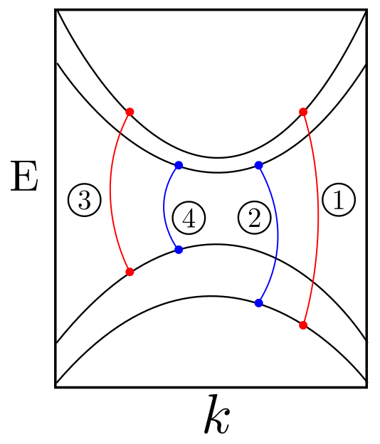

# Effective Bethe-Salpeter Equation

## Description

The aim of this project is to solve the effective Bethe-Salpeter (BSE) equation in order to get the excitonic energies out of an effective $\mathbf{k} \cdot \mathbf{p}$ Hamiltonian.

## Installation

## How to use this code

#### Energies + Wave functions

To calculate the *binding energies* and the *envelope wave functions* for the excitons we have to use the script called 

* **`bse_solver.py`**

with a input file called 

* **`infile.txt` **

In the input file the user can specify the Hamiltonian and the values assumed for its parameters. (*TO-DO*: explain the structure of  `infile.txt`).

By default, the results will be saved in the same directory  from which the code is called in a file named

*  **`results_bse.npz`**    

#### Absorption

To calculate the absorption spectrum, the user have to use the script 

* **`absorption.py`**

 and, in addition to the input file **`infile.txt`** already mentioned, the file **`absorption_infile.txt`** is also required to be at the same directory. 

The absorption is calculated using the results in `results_bse.npz`, and then saved in a new file that, by default, is called

* **`results_absorption.npz`**

#### (Energies + Wave functions) + Absorption

To facilitate the process of calculating the absorption from start, we have the script

* **`script_for_bin.py`**

This script will call the main methods of both `bse_solver` and `absorption` modules in order to calculate and save the outputs files `results_bse.npz` and `results_absorption.npz`.

### Special scripts

#### `bse_solver_with_args.py`

To use this script, one has to pass the 2 (two) mandatory arguments: 

*  input file: path for the input file;
* output file: first part of the output file => it will be complemented by `"_eps_$epsilon"` at the end

In addition to that, there are some optional arguments as well:

* `-e`, `--epsilon`
* `-s`, `--save`
* `-p`, `--preview`

#### `absorption_with_args.py`

**Attention!** The names of the input files might be altered so it is important to verify the definitions before start calculations. 

**Attention!** The Hamiltonian informed by **`infile.txt`** has to be one of the ("concrete") classes implemented in  `hamiltonians.py`.

## How to interpret the results

The most important part of the physicist's job is to interpret the results of a calculation, simulation or experiment. In our case, since the heart of the present code is the solution of an eigenvalue problem, let's see what is expected to get at the end of the calculation.

#### `bse_solver.py` and `bse_solver_with_inputs.py`:

When the `save` option is turned on, what is highly recommended, both scripts return a file with the extension `.npz` containing two arrays called:

  * `eigvals_holder`
  * `eigvecs_holder`

The way one interpret the results in those arrays depends ultimately on the Hamiltonian basis given as input. Let's take an concrete example, the Hamiltonian `H4x4_Kormanyos_Fabian` defined in `hamiltonians.py`. This Hamiltonian is given in the basis $\{|v\uparrow\rangle, |v\downarrow\rangle, |c\uparrow\rangle, |c\downarrow\rangle \}$, where $v(c)$ represents the valence (conduction) band. Notice that the attributes `valeBands` and `condBands` have to match the information that the model Hamiltonian consider 2 valence bands and 2 conduction bands. Thus, we have

  * `valeBands = 2`
  * `condBands = 2`

Then, for each point in the k-space we'll get 4 eigenstates for such a Hamiltonian. Since we have been adopting the ` numpy.linalg.eigh`, the order in which the states are returned is ascending in energy. To better understand the way the results are organized, let me introduce the (sometimes confusing) name convention adopted:

  * $E_{v1} < E_{v2} < E_{c2} < E_{c1}$

Notice how the valence bands energies are called and compare with how the conduction band are named. Basically, we tag the valence bands in an ascending way in energy and in a descending way for conduction bands.

Now, recalling how the BSE-matrix are build using these states, one can better understand the final results recorded in `eigvals_holder` and `eigvecs_holder`. Looking at the function `diagonal_elements` located at the module `bethe_salpeter_equation.py` we see that the basis adopted for the BSE-matrix is given by

$$
|c_1, v_1\rangle, |c_2, v_1\rangle, |c_1, v_2\rangle, |c_2, v_2\rangle
$$

<!--  -->

## Organization of the code

The following scripts together form the backbone of the project:

* `script_for_bin.py`
  * `bse_solver.py`
    * `bethe_salpeter_equation.py`
    * `hamiltonians.py`
    * `treat_files.py`
  * `absorption.py`
    * `physical_constants.py`
    * `bethe_salpeter_equation.py`
    * `hamiltonians.py`
    * `treat_files.py`

Where the indentation means dependency. There are some cross dependencies as well between the scripts but the main message here is that, to run the `script_for_bin.py`, the following scripts are necessary:

* `bse_solver.py`
* `absorption.py`
* `bethe_salpeter_equation.py`
* `hamiltonians.py`
* `treat_files.py`
* `physical_constants.py` 

## Improvements for the future
